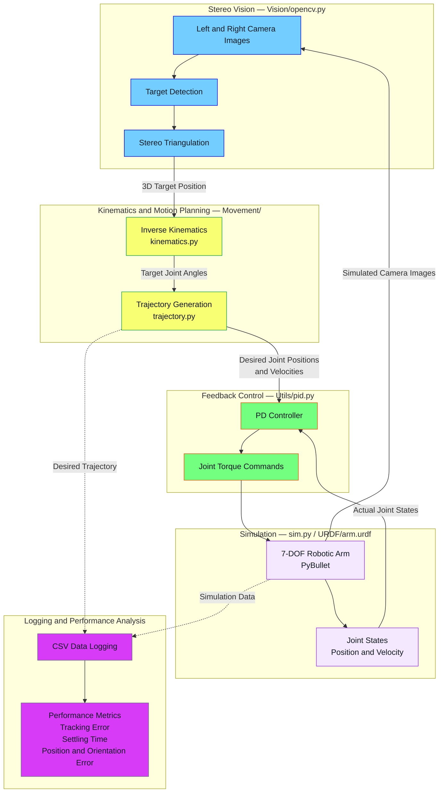

# Canadarm3 Simulation

A personal robotics simulation project inspired by **Canadarm3**, the robotic arm being developed for the Lunar Gateway.

The goal of this project is to explore robotic arm modeling, kinematics, computer vision, and autonomous positioning using a simulated environment.

## How to Run

1. Clone the repository.
2. Install the required Python dependencies:

```bash
pip install -r requirements.txt
```
3. Run the simulation

```bash
python Main.py
```
## Features
- 3D robotic arm simulation using pybullet
- URDF robot model
- Stereo computer vision 
- 3D triangulation
- Triangulation error checking to reject unreliable measurements
- Automatic aiming toward a detected target
- OpenCV target detection
- Inverse kinematics
- Forward kinematics
- Position error checking
- Last-known-target tracking when the target is temporarily out of sight

## Demo 

## Reference Data:
- source: https://www.asc-csa.gc.ca/eng/iss/canadarm2/canadarm-canadarm2-canadarm3-comparative-table.asp 
- Length = 8.5m long arm 
- Mass = 1076kg
- Diameter = 23cm
- Composition = carbon fiber composite
- joint rotation = 358°(estimation)

## Estimated Simulation Configuration:
```
GATEWAY / BASE
    │
    │
    ▼
┌───────────────┐
│ SHOULDER      │
│ J1 J2 J3      │
└──────┬────────┘
       │
       │ 520 mm shoulder assembly
       │
       ▼
════════════════════════════════════
       BOOM A
       3,350 mm
════════════════════════════════════
       │
       ▼
   ┌─────────┐
   │ ELBOW   │
   │   J4    │
   └────┬────┘
        │
        │
════════════════════════════════════
       BOOM B
       3,450 mm
════════════════════════════════════
        │
        ▼
   ┌───────────────┐
   │ WRIST         │
   │ J5 J6 J7      │
   └──────┬────────┘
          │
          │ 300 mm
          ▼
     ┌─────────┐
     │   LEE   │
     │  HAND   │
     └─────────┘
```

## Note:
The dimensions and joint arrangements shown above are my estimates created only for this project. This project is intended as an educational simulation than a replica of the flight system 

## Technologies
- Python
- PyBullet
- NumPy
- OpenCV
- URDF
- Git 

## What I Learned
- Coordinate frames and transformations
- Stereo vision and triangulation
- Computer vision with OpenCV
- URDF robot modeling
- Quaternions vs Euler angles
- Inverse kinematics
- Forward kinematics
- Numpy
- 3D triangulation

# accuracy  
## Inverse kinematics
- Number of tests: 10,000
- Reachable targets: 9,335/10000
- Reachable target success rate: 93.35%
- Unreachable targets: 665/10,000 (6.65%)
- Max iterations reached: 665/10000 (6.65%)
  
```The unreachable targets are most likely caused by physically impossible positions, such as targets located inside the robotic arm or singularities```

### Position
- Average Position Error: 0.0000476238 m
- Max Position Error: 0.0000989956 m

### Orientation
- Average Orientation Error: 0.0000487156 rad (0.002791°)
- Max Orientation Error: 0.0000999895 rad (0.005729°)

### Media


## Vision
### Set up

- Number of tests: 1000
- Object: sphere2.urdf
- change DETECT_COLOR_MIN Constant to [0, 0, 0] (to detect all colors)

```The error can depend on the shape of the object and where the centeroid is located. A circle and sphere are the best shapes to test the accuracy)```

### Error mesurements  
- Mean error: 0.09076341669262535 m
- Maximum error: 8.911642841986879 m  
``` only once happend, and it was the last value before stopping detecting targets ```
- Detection rate: 66.5%
- Number of accepted tests: 665/1000
``` The error is caused by not being able to detect the object correctly (because it was too far)```
- best before 6.519202405202649 m

### Results 
The mean position error across accepted detections was approximately 9.08 cm. The maximum error of 8.91 m occurred only once, in the final measurement before target detection stopped, this affects the mean error, so in a average scenario it should be less than the obtained results.

The primary limitation is the detection range. As the target moves farther away, the vision system becomes less reliable, resulting in missed detections and occasional large position errors.

The best tested distance was approximately 6.52 m.

### Media


## System Architecture

The system integrates stereo vision, custom kinematics, trajectory generation, and PD control in a PyBullet simulation environment.



### Data Flow

1. **Perception:** Stereo camera images estimate the target 3D position.
2. **Kinematics:** The inverse kinematics calculates the joint configuration required to reach the target.
3. **Trajectory Planning:** The trajectory generator produces a time dependent joint references.
4. **Control:** The PD controller uses desired and actual joint states to calculate torque.
5. **Simulation:** PyBullet simulates the robot and provides joint states and cameras
6. **Evaluation:** Logged data is used to analyze accuracy, settling behavior, and system performance.